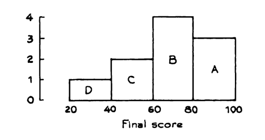
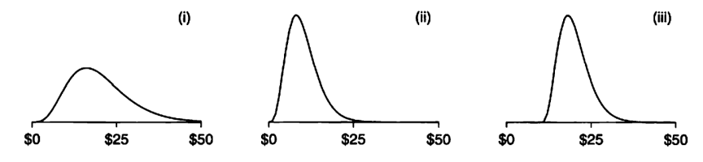

```{r setup, include=FALSE}
knitr::opts_chunk$set(echo = TRUE)
```

# Exercício 1

O histograma abaixo mostra a distribuição das notas em avaliações finais em um certo curso.

```{r}

```

## a)

Qual bloco representa as pessoas que tiraram entre 60 e 80?

## b)

10% tiraram entre 20 e 40, quantos % tiraram entre 40 e 60?

## c)

Qual percentual tirou acima de 60?

# Exercício 2

Em uma pesquisa coletou-se o salário por hora de três grupos de pessoas. As pessoas do grupo B ganham aproximadamente o dobro das pessoas do grupo A e as pessoas do grupo C ganham aproximadamente $10 a mais do que as do grupo A. Qual histograma pertence a qual grupo?

```{r}

```

# Exercício 3

No contexto de preenchimento de um formulário de cadastro, Classifique as variáveis em quantitativas contínuas, quantitativas discretas, qualitativas ou qualitativas ordinais e justifique sua resposta.

## a) Ocupação

## b) Escolaridade

## c) Região de residência

## d) Peso

## e) Altura

## f) Número de veículos 

## g) 

# Exercíco 4

Instale o pacote `dados` utilizando o comando `install.packages(dados)`.

Nos exercícios a seguir considere o conjunto de dados acessível pela sintaxe `dados::casas `.

# Exercício 4

## a) 

Classifique de acordo com o tipo de variável as variáveis `primeiro_andar_area`, `segundo_andar_area` e `geral_qualidade` e `moradia_estilo`

## b)

Construa histogramas de contagem para as variáveis  `primeiro_andar_area` e `segundo_andar_area`

## c)

Construa histogramas de densidade para comparar os histogramas de `primeiro_andar_area` e `segundo_andar_area` entre as categorias da variável `geral_qualidade`


