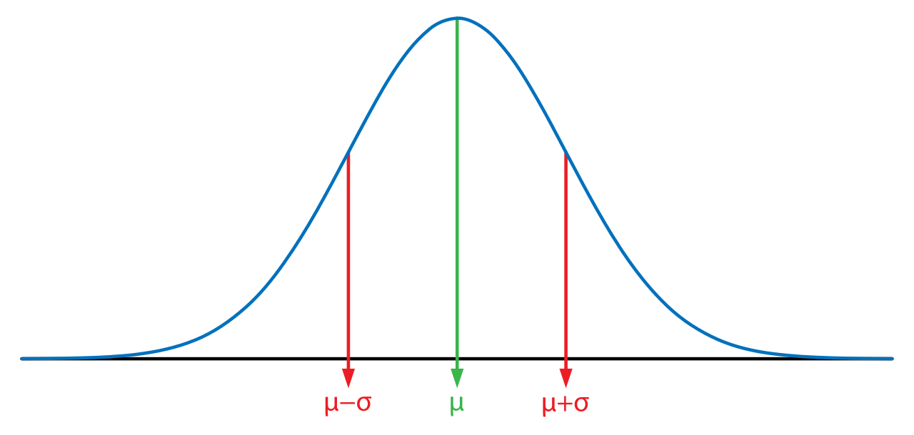

```{r, include = FALSE}
library(tidyverse)

chuvas <- readRDS("../dados/chuvas_A701.rds")

knitr::opts_chunk$set(message = FALSE, warning = FALSE, error = FALSE)
```


# Nas últimas aulas...

(1) Definição: Estatística é o estudo da incerteza usando probabilidade

--

(1) Incerteza para estatística quer dizer variabilidade

--

(1) Exploramos estatísticas como histogramas, contagens e médias como forma de caracterizar a variabilidade (incerteza) percebida em uma amostra de dados

--

(2) Análises estatísticas comparam observações com a **distribuição amostral** esperada em certos cenários

--

Exemplo: A média de 10 lançamentos de dois dados honestos fica ente 4 e 9 na esmagadora maioria das amostras

---

# Distribuições amostrais

Na última aula conversamos sobre uma ferramenta muito conveniente e poderosa para descobrir distribuições amostrais:

```{r, echo = FALSE, fig.height=3.5, dpi = 700}
library(dagitty)
library(ggdag)
library(ggplot2)

dag <- dagify(Soma ~ DV + DB)

dag |> 
  ggdag(layout = "kk") +
  theme_dag_blank()
```

---

# Distribuições amostrais

Descobrir distribuição amostral da média:

$$\text{Defino mecanismo de geração} \rightarrow \text{gero }n\text{ amostras} \rightarrow$$

$$\text{Calculo a média de cada amostra} \rightarrow \text{Desenho o histograma}$$

---

# Simulando distribuições amostrais no R

Vamos simular várias distribuições no R hoje! O padrão dos nossos códigos vai ser sempre o mesmo:

```{r, eval = FALSE}
# Input

numero_de_simulacoes <- 10000
tamanho_da_amostra <- 10

# Sorteio:

amostras <- map(
  # função que vai repetir uma função "numero_de_simulacoes" vezes
  1:numero_de_simulacoes,
  # estamos informando o número de simulações
  ??????
  # aqui vai nosso código que implementa a geração dos dados)
```

---

# Simulando distribuições amostrais no R

Vamos simular várias distribuições no R hoje! O padrão dos nossos códigos vai ser sempre o mesmo:

```{r, eval = TRUE}
# Input

numero_de_simulacoes <- 10000
tamanho_da_amostra <- 10

# Sorteio:

amostras <- map(
  # função que vai repetir uma função "numero_de_simulacoes" vezes
  1:numero_de_simulacoes,
  # estamos informando o número de simulações
  sample,
  x = 1:6,
  size = tamanho_da_amostra
  # aqui vai nosso código que implementa a geração dos dados)
)
```

---

# Simulando distribuições no R

```{r, eval = FALSE}

amostras

```

Três primeiros exemplos de `amostra`:

```{r, echo = FALSE}

amostras[1:3]

```

---

# Simulando distribuições no R

Distribuição amostral da média de $n=1$ lançamentos de $1$ dado honesto

$$\bar{x} = \frac{\sum_{i=1}^n x_i}{n} = \frac{\sum_{i=1}^1 x_i}{1} = x_1$$
```{r, echo = FALSE, fig.height=4}
numero_de_simulacoes <- 200000
espaco_amostral <- 1:6
tamanho_da_amostra <- 1

amostras <- map(1:numero_de_simulacoes,
           sample,
           x = espaco_amostral,
           size = tamanho_da_amostra)

medias <- map_dbl(amostras, mean)

tabela <- tibble(medias)

m0 <- tabela |>
  ggplot(aes(x = medias)) +
  geom_histogram(
    fill = 'royalblue', color = 'white',
    bins = floor(log(numero_de_simulacoes, base = 2))
  ) +
  theme_bw(15) +
  labs(x = "Médias", y = "Contagem")

m0
```

---

# Simulando distribuições no R

Distribuição amostral da média de $n=2$ lançamentos de $2$ dados honestos

$$\bar{x} = \frac{\sum_{i=1}^2 x_i}{2} = \frac{x_1+x_2}{2}$$

```{r, echo = FALSE, fig.height=4}
numero_de_simulacoes <- 200000
espaco_amostral <- 1:6
tamanho_da_amostra <- 2

amostras <- map(1:numero_de_simulacoes,
           sample,
           x = espaco_amostral,
           size = tamanho_da_amostra)

medias <- map_dbl(amostras, mean)

tabela <- tibble(medias)

m1 <- tabela |>
  ggplot(aes(x = medias)) +
  geom_histogram(
    fill = 'royalblue', color = 'white',
    bins = floor(log(numero_de_simulacoes, base = 2))
  ) +
  theme_bw(15) +
  labs(x = "Médias", y = "Contagem")

m1
```

---

# Simulando distribuições no R

Distribuição amostral da média de $n=10$ lançamentos de $2$ dados honestos

$$\bar{x} = \frac{\sum_{i=1}^{10} x_i}{10} = \frac{x_1+x_2+...+x_{10}}{10}$$

```{r, echo = FALSE, fig.height=4}
numero_de_simulacoes <- 200000
espaco_amostral <- 1:6
tamanho_da_amostra <- 10

amostras <- map(1:numero_de_simulacoes,
           sample,
           x = espaco_amostral,
           size = tamanho_da_amostra)

medias <- map_dbl(amostras, mean)

tabela <- tibble(medias)

m2 <- tabela |>
  ggplot(aes(x = medias)) +
  geom_histogram(
    fill = 'royalblue', color = 'white',
    bins = floor(log(numero_de_simulacoes, base = 2))
  ) +
  theme_bw(15) +
  labs(x = "Médias", y = "Contagem")

m2
```

---

# Simulando distribuições no R

Distribuição amostral da média de $n=10$ lançamentos de $2$ dados honestos

$$\bar{x} = \frac{\sum_{i=1}^{100} x_i}{100} = \frac{x_1+x_2+...+x_{100}}{100}$$

```{r, echo = FALSE, fig.height=4}
numero_de_simulacoes <- 200000
espaco_amostral <- 1:6
tamanho_da_amostra <- 100

amostras <- map(1:numero_de_simulacoes,
           sample,
           x = espaco_amostral,
           size = tamanho_da_amostra)

medias <- map_dbl(amostras, mean)

tabela <- tibble(medias)

m3 <- tabela |>
  ggplot(aes(x = medias)) +
  geom_histogram(
    fill = 'royalblue', color = 'white',
    bins = floor(log(numero_de_simulacoes, base = 2))
  ) +
  theme_bw(15) +
  labs(x = "Médias", y = "Contagem")

m3
```

---

# Simulando distribuições no R

O que está acontecendo abaixo?

```{r, echo = FALSE, fig.height=5}
library(patchwork)

((m0 + ggtitle("n = 1")) + (m1 + ggtitle("n = 2")))/
((m2 + ggtitle("n = 10")) + (m3 + ggtitle("n = 100")))
```

---

# Simulando distribuições no R

Aparentemente a distribuição da média amostral (isso é, como a estatística média se distribui em grandes conjuntos de simulações) no caso do dado converge sempre para o mesmo desenho.

Simulando do dado de 6 faces, $n = 100$

```{r, echo = FALSE}
numero_de_simulacoes <- 10000
espaco_amostral <- 1:6
tamanho_da_amostra <- 100

amostras <- map(1:numero_de_simulacoes,
           sample,
           x = espaco_amostral,
           size = tamanho_da_amostra)
```

```{r, fig.height=5}
media <- mean(medias)
sd <- sd(medias)

g1 <- tabela |>
  mutate(
    normal = dnorm(medias, media, sd)
  ) |>
  ggplot(aes(x = medias,  after_stat(density))) +
  geom_histogram(
    fill = 'royalblue', color = 'white',
    bins = floor(log(numero_de_simulacoes))
  ) +
  theme_bw(15) +
  labs(x = "Médias", y = "Densidade")

g1

```

---

# Simulando distribuições no R

Simulando do dado de 6 faces, $n = 100$, existe uma previsão matemática de qual deve ser o formato da distribuição amostral da média

```{r, echo = FALSE}
# Dados + Normal ----------------------------------------------------------

media <- mean(medias)
sd <- sd(medias)

g1+
  geom_line(aes(x = medias, y = normal), linetype = 2,
            color = 'red', size = 3)
```

---

# Distribuições amostrais teóricas

Essa curva vermelha que apareceu não foi por acaso

--

Certas distribuições amostrais são previstas pela teoria das probabilidades

--

Médias amostrais de amostras de tamanho *grande* tem um histograma parecido parecido com uma curva em forma de sino

--

Isso é um resultado matemático conhecido como Teorema Central do Limite!

--

Esse histograma "teórico" tem nome de distribuição **normal** ou **gaussiana**

---

# Distribuições de probabilidade

Como as médias amostrais tem uma tendência a apresentar um histograma com curva em forma de sino, o entendimento matemático sobre essa curva é muito bem desenvolvido

--

As expectativas que temos em estatística sobre histogramas são conhecidas como **distribuições de probabilidade**

--

Distribuições de probabilidade são "histogramas teóricos" que indicam o que seria o histograma caso fossem realizadas infinitas observações 

--

Se tivéssemos infinitas observações o histograma não teria nenhum degrau visível, apenas uma curva que parece uma linha contínua

---

# Distribuições de probabilidade contínuas

Assim como variáveis, distribuições de probabilidade podem ser quantitativas (contínuas ou discretas), qualitativas e mistas

--

Distribuições de probabilidade quantitativas contínuas (ou só contínuas) assumem valores quebrados com qualquer quantidade de casas decimais: bem quebrados

--

Muitas distribuições de probabilidade contínuas são caracterizadas por sua **densidade de probabilidades**, que é exatamente o "histograma teórico" de infinitas observações de que seguem essa distribuição

--

Podemos simular variáveis com distribuições contínuas no computador

---

# Distribuição normal

Abaixo simulamos uma observação de uma variável aleatória com distribuição normal padrão, sem parâmetros especiais:

```{r}
rnorm(1)
```

---

# Distribuição normal

O histograma de 1000 observações é:

```{r, fig.height=5}
hist(rnorm(1000))
```

---

# Distribuição normal

O histograma de 1000000 observações e breaks padrão

```{r, fig.height=5}
hist(rnorm(10000000))
```

---

# Distribuição normal

O histograma de 1000000 observações e 1000 breaks. O histograma teórico realmente aparece depois de muitas e muitas observações

```{r, fig.height=5}
hist(rnorm(10000000), breaks = 1000)
```

---

# Distribuição normal

A distribuição normal é caracterizada por uma média teórica $\mu$ e um desvio padrão teórico $\sigma$. Uma distribuição normal tem pouca variação ao redor de sua média, e quem governa essa variação é o desvio padrão: 


```{r, fig.height=2, echo = FALSE}

```

Se fizermos uma amostra de tamanho $n$ de uma variável $X$ que segue uma distribuição normal com média $\mu$ e desvio padrão $\sigma$ a **tendência** é que quão maior for o $n$ a média amostral vai se aproximar de $\mu$ e o desvio padrão amostral vai se aproximar de $\sigma$

---


# Estatísticas descritivas | Desvio padrão

Passo-a-passo do cálculo do desvio padrão amostral:

--

Observações numéricas:

$x_1, x_2, x_3, x_4 = 1, 2, 4, 3$

--

1. Calcule a média::

$$\text{Média} = \frac{x_1+x_2+x_3+x_4}{4} = \bar{x} = \frac{1+2+4+3}{4} = \frac{10}{4} = 2.5$$

--

2. Calcular os desvios (com relação a média):

$$\text{Desvio-}1 = x_1-\bar{x} = 1-2.5 = -1.5$$
$$\text{Desvio-}2 = x_2-\bar{x} = 2-2.5 = -0.5$$
$$\text{Desvio-}3 = x_3-\bar{x} = 4-2.5 = 1.5$$
$$\text{Desvio-}4 = x_4-\bar{x} = 3-2.5 = 0.5$$

---

# Estatísticas descritivas | Desvio padrão

3. Calcule os desvios ao quadrado:

$$\text{Desvio-ao-quadrado-}1 = (x_1-\bar{x})^2 = (1-2.5)^2 = (-1.5)^2 = 2.25$$
$$\text{Desvio-ao-quadrado-}2 = (x_1-\bar{x})^2 = (2-2.5)^2 = (-0.5)^2 = 0.25$$
$$\text{Desvio-ao-quadrado-}3 = (x_1-\bar{x})^3 = (4-2.5)^2 = (1.5)^2 = 2.25$$
$$\text{Desvio-ao-quadrado-}4 = (x_1-\bar{x})^4 = (3-2.5)^2 = (0.5)^2 = 0.25$$
--

4. Calcule a média dos desvios ao quadrado:

$$\text{Desvio Ao Quadrado Médio} = \frac{2.25+0.25+2.25+0.25}{4} = \frac{5}{4} = 1.25$$

--

5. Calcule a raiz da média dos desvios ao quadrado:

$$\text{Desvio padrão} = \sqrt{1.25} = 1.12$$

---

# Distribuições de probabilidade

A distribuição normal é importante porque ela aparece na prática: no nosso estudo de simulações ela apareceu naturalmente

--

Dizemos que uma variável $X$ segue uma distribuição normal com média $\mu$ e desvio padrão $\sigma$ pela seguinte notação:

$$X \sim N(\mu, \sigma)$$

--

O **Teorema Central do Limite** garante que em muitas situações a distribuição normal vai aparecer

--

Ele diz que, se observamos muitas amostras independentes $X_1$, ..., $X_n$, teremos aproximadamente

$$\bar{X} \sim N(\mu, \sigma/\sqrt{n})$$

--

No geral, as observações que fazemos $X_1$, $X_2$, ..., $X_n$ não seguem a distribuição normal, mas elas provavelmente possuem alguma outra distribuição

--

A essa distribuição "desconhecida" do nosso $X$ nós damos o nome de **distribuição populacional**

--

O nome se aplica a vários casos de interesse da estatística, mas é inspirado principalmente pela modelagem em problemas de amostragem

---

# Amostragem

Amostragem é o primeiro "caso real" em que estatística aparece de maneira natural e útil na vida real. Ela aparece em surveys, pesquisas eleitorais, de opinião etc

--

Vamos pensar que queremos estudar a altura das mulheres entre 20 e 60 anos em São Paulo

--

Essa informação efetivamente existe, bastaria que fossemos lá medir as milhões de mulheres que vivem em São Paulo

--

Isso não é possível na prática, seria muito caro ir atrás de todas as mulheres, ou pedir pra elas se medirem e mandarem pra gente etc

--

De toda forma, vamos pensar que existe essa lista, teoricamente, e vamos representar as alturas pela letra $A$:

$$A_1, A_2, ..., A_M$$

Onde $M$ é o número de mulheres entre 20 e 60 anos em São Paulo

--

Essa é a nossa população de estudo

---

# Amostragem

Vamos dizer que é possível, e normalmente é possível aproximadamente, garantir que todas as mulheres tem igual chance de entrar na nossa amostra de tamanho $n$

--

Nós temos uma lista com todos os CPFs e gêneros das mulheres, por exemplo

--

$X_i$ então será a altura da $i$-ésima mulher na nossa amostra, sorteada da população

--

A distribuição populacional de $X_i$, isso é, a distribuição que gera nossa amostra, é uma distribuição uniforme dentre o conjunto das alturas $A_1, A_2, ..., A_M$

--

Isso é fácil de simular no $R$!

---
