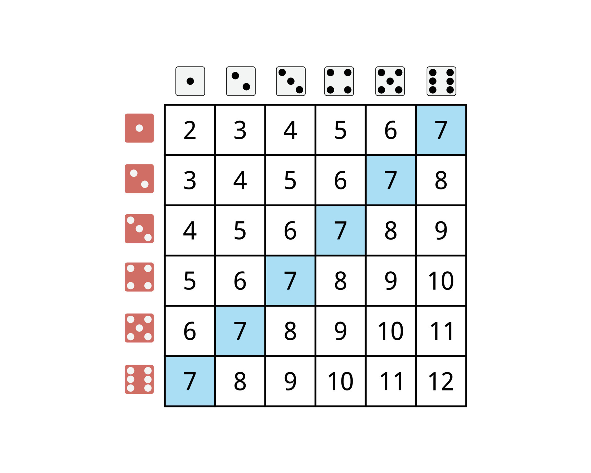
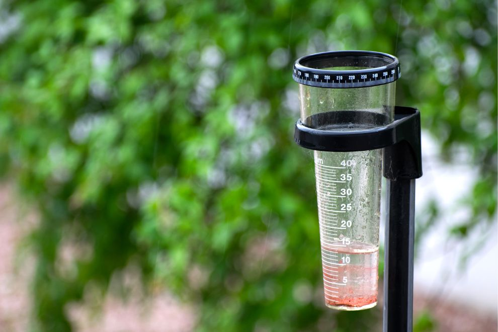
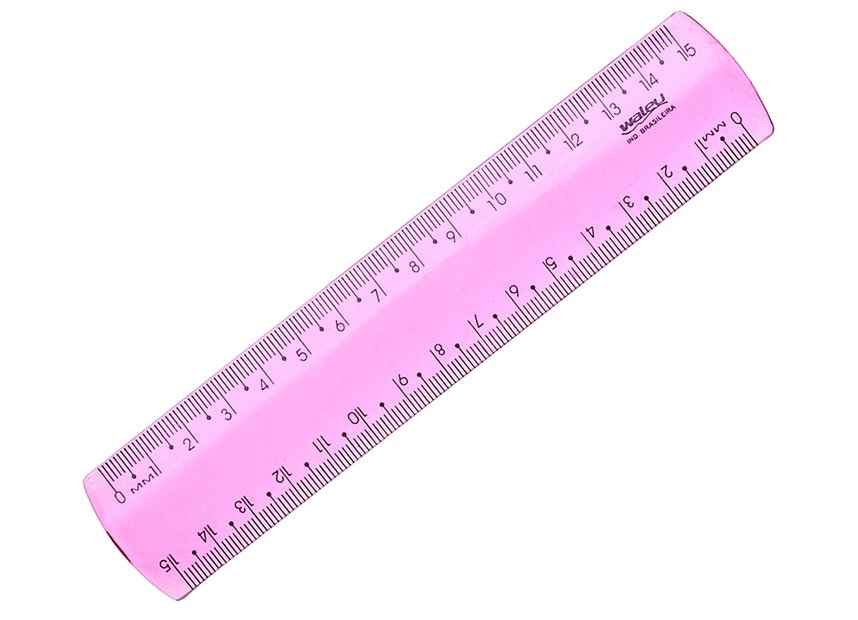

```{r, include = FALSE}
library(tidyverse)

chuvas <- readRDS("../dados/chuvas_A701.rds")

knitr::opts_chunk$set(message = FALSE, warning = FALSE, error = FALSE)
```


# Introdução

Estatística é uma área do conhecimento que aplica Teoria das Probabilidades para quantificar a **incerteza** sobre qualquer observação do mundo

--

Por **incerteza** devemos entender qualquer variabilidade em observações do mundo

--

Se jogarmos um dado de 6 lados 60 vezes não sabemos com certeza quantas vezes vai dar 1

--

Estatística nos diz que vai ficar perto de 10 e quão difícil é ficar longe de 10

--

De maneira simples estatística consiste em aplicar a mesma análise que podemos fazer de um jogo de azar para qualquer situação em que haja incerteza

---

# Situação 1: Rolagem de dados

**Observação**: jogar dois dados, um branco e um vermelho, e anotar a soma dos resultados

```{r, echo = FALSE, out.width="70%"}

```

---

# Situação 2: Medição de temperatura

**Observação**: Todos os dias das 9h às 18h vamos anotar a temperatura de um daqueles termômetros que ficam na rua. Ao final do dia às 18h vamos fazer a média dos números que vimos e calcular a média.

```{r, out.width="70%", echo = FALSE}
knitr::include_graphics("../images/termometro.jpg")
```

---

# Situação 3: Medição de chuva (pluviometria)

**Observação**: quando chover, deixar um medidor na janela. Quando acabar de chover, anotar quanta água tem no copo. Em várias chuvas diferentes o resultado varia

```{r, echo = FALSE, out.width="70%"}

```

---
# Variabilidade 

A variabilidade que existe em jogos de azar pode ser descrita matematicamente de maneira muito precisa.

--

Em praticamente todos os outros casos a estatística nos dá ferramentas para descrever matematicamente a variabilidade de observações, mas dificilmente é perfeito.

--

"Todos os modelos estão errados, mas alguns são úteis." - George Box

---

# Estatística e Matemática

Como vamos ver ao longo do curso, para dizer "como que um experimento varia" a **linguagem matemática** tem algumas vantagens:

--

1. É mais preciso. "52% das vezes os lançamentos dos dados foram maiores do que 4" é mais preciso do que "na maior parte das vezes os dados foram maiores do que 4"

--

2. Expressa mais com menos símbolos

--

**Como assim?**

--

Em português: "a média é dada pela soma dos valores da variável dividido pelo número de observações".

--

Em matematiquês:

$n$: número de observações
$X = (x_1, x_2, ..., x_n)$: observações

$$\text{Média}(X) = \frac{x_1+x_2+...+x_n}{n} = \frac{\sum_{i=1}^n x_i}{n}$$

---

# Estatística e Matemática

Muita gente não gosta de estatística porque não gosta de matemática

--

O uso principal da matemática por **praticantes** de estatística é fornecer uma **linguagem**

--

Também para que você consiga consumir adequadamente os métodos em geral

--

Quanto mais matemática você souber melhor, o imprescindível é:

- Ler e construir gráficos
- Álgebra elementar
  - Interpretar expressões com letras e números
  - Abrir contas na mão
- Conjuntos
- Funções
- Logaritmos

---

# Estatística e Matemática

Muita gente não gosta de estatística porque não gosta de matemática

O uso principal da matemática por **praticantes** de estatística é fornecer uma **linguagem**

Também para que você consiga consumir adequadamente os métodos em geral

Quanto mais matemática você souber melhor, o imprescindível é:

- **Ler e construir gráficos**
- **Álgebra elementar** [--MUITO IMPORTANTE!--]
  - Intepretar expressões com letras e números
  - Abrir contas na mão
- Conjuntos
- Funções
- Logaritmos
- **Pensamento matemático**

Ao longo do curso vamos treinar as traduções de português para matematiquês no contexto estatístico

---

# Caracterizando a variabilidade

Toda **coluna** de banco de dados, ou até mesmo conjuntos de banco de dados, variam de um jeito particular

--

Em estatística o nome técnico de um fenômeno observado é **variável**

--

Esse nome se deve ao fato de, por premissa, acreditarmos que podemos observar resultados incertos dentro de determinadas possibilidades

--

**Variáveis**, normalmente representadas nas fórmulas por letras maísculas $X$ e $Y$, assumem valores em um **espaço amostral** 

--

**espaço amostral** é o **conjunto** de possibilidades para as minhas medições. Em algumas situações esse conjunto é representado pela letra $\Omega$. No geral não vamos usar essa notação.

---

# Situação 1: Rolagem de dados

**Observação**: jogar dois dados, um branco e um vermelho, e anotar a soma dos resultados

--

$$X = \text{Resultado do dado branco} + \text{Resultado do dado vermelho}$$
--

**Espaço amostral**: $\{2, 3, 4, 6, 7, 8, 9, 10, 11, 12\}$

---

# Caracterizando a variabilidade

Vamos dizer que observamos a seguinte amostra de 100 observações da variável $X$:

```{r, echo = FALSE}
set.seed(1)

dados = tibble::tibble(
  x = sample(1:6, size = 100, replace = TRUE)+sample(1:6, size = 100, replace = TRUE)
)
```

--

Normalmente registramos esse tipo de medição em tabelas (exemplo de 10 linhas):

```{r, echo = FALSE}
dados |>
  head() |> 
  mutate(`Observação` = 1:n(), .before = x) |> 
  knitr::kable()
```

---

# Caracterizando a variabilidade

Contagens são o jeito mais básico de caracterizar a variabilidade de uma variável:

.pull-left[
```{r, echo = FALSE, out.width="100%"}
dados |> 
  ggplot(
    aes(x = x)
  ) + 
  geom_bar() +
  scale_x_continuous(breaks = seq(2,12)) +
  labs(x = "Soma dos dados", y = "Contagem") +
  theme_bw(20)
```
]

--

.pull-right[
- As colunas representam contagens para cada valor observado de x
]
---

# Caracterizando a variabilidade

Contagens são o jeito mais básico de caracterizar a variabilidade de uma variável:

.pull-left[
```{r, echo = FALSE, out.width="100%"}
dados |> 
  mutate(
    total = n()
  ) |> 
  count(total, x) |> 
  ggplot(aes(x = x, y = n/total)) +
  geom_col() +
  scale_x_continuous(breaks = seq(2,12)) +
  labs(x = "Soma dos dados", y = "Frequencia relativa (Contagem/Total)")+
  theme_bw(20)
```
]

.pull-right[
- As colunas representam contagens para cada valor observado de x

- Se dividirmos a contagem pelo número de observações (que aqui vale 100), teremos percentuais
]

---

# Caracterizando a variabilidade

Contagens são o jeito mais básico de caracterizar a variabilidade de uma variável:

.pull-left[
```{r, echo = FALSE, out.width="100%"}
dados |> 
  mutate(
    total = n()
  ) |> 
  count(total, x) |> 
  ggplot(aes(x = x, y = n/total)) +
  geom_col() +
  scale_x_continuous(breaks = seq(2,12)) +
  labs(x = "Soma dos dados", y = "Frequencia relativa (Contagem/Total)")+
  theme_bw(20)
```
]

.pull-right[

Esse padrão de gráfico (contagem em colunas) é útil e bastante usado porque chama a atenção para pontos importantes da distribuição dos dados no eixo X:

]

---

# Caracterizando a variabilidade

Contagens são o jeito mais básico de caracterizar a variabilidade de uma variável:

.pull-left[
```{r, echo = FALSE, out.width="100%"}
dados |> 
  mutate(
    total = n()
  ) |> 
  count(total, x) |> 
  ggplot(aes(x = x, y = n/total)) +
  geom_col() +
  scale_x_continuous(breaks = seq(2,12)) +
  labs(x = "Soma dos dados", y = "Frequencia relativa (Contagem/Total)")+
  theme_bw(20)
```
]

.pull-right[

Esse padrão de gráfico (contagem em colunas) é útil e bastante usado porque chama a atenção para pontos importantes da distribuição dos dados no eixo X:

- A rolagem mais frequente é 7


]

---

# Caracterizando a variabilidade

Contagens são o jeito mais básico de caracterizar a variabilidade de uma variável:

.pull-left[
```{r, echo = FALSE, out.width="100%"}
dados |> 
  mutate(
    total = n()
  ) |> 
  count(total, x) |> 
  ggplot(aes(x = x, y = n/total)) +
  geom_col() +
  scale_x_continuous(breaks = seq(2,12)) +
  labs(x = "Soma dos dados", y = "Frequencia relativa (Contagem/Total)")+
  theme_bw(20)
```
]

.pull-right[

Esse padrão de gráfico (contagem em colunas) é útil e bastante usado porque chama a atenção para pontos importantes da distribuição dos dados no eixo X:

- A rolagem mais frequente é 7

- A rolagem menos frequente é 12

]

---

# Caracterizando a variabilidade

Contagens são o jeito mais básico de caracterizar a variabilidade de uma variável:

.pull-left[
```{r, echo = FALSE, out.width="100%"}
dados |> 
  mutate(
    total = n()
  ) |> 
  count(total, x) |> 
  ggplot(aes(x = x, y = n/total)) +
  geom_col() +
  scale_x_continuous(breaks = seq(2,12)) +
  labs(x = "Soma dos dados", y = "Frequencia relativa (Contagem/Total)")+
  theme_bw(20)
```
]

.pull-right[

Esse padrão de gráfico (contagem em colunas) é útil e bastante usado porque chama a atenção para pontos importantes da distribuição dos dados no eixo X:

- A rolagem mais frequente é 7

- A rolagem menos frequente é 12

- Mais ou menos 25 rolagens resultaram em 9 ou 20

]

---

# Caracterizando a variabilidade

.pull-left[
Dados brutos (exemplos):

```{r, echo = FALSE}
set.seed(1)

dados |>
  mutate(`Observação` = 1:n(), .before = x) |> 
  sample_n(size = 10) |> 
  knitr::kable()
```

]

.pull-right[

Passo 1: Transformar em contagem

```{r, echo = FALSE}
dados |> 
  group_by(x) |> 
  summarise(
    `Frequência` = n()
  ) |> 
  knitr::kable()
```
]

---

# Situação 2: Medição de temperatura

**Observação**: coletar a temperatura marcada por um termômetro várias vezes por dia, todo dia e tirar a média. Em vário dias esse valor varia

--

$$C = \text{Média das temperaturas marcadas pelo termômetro}$$
--

Em português:

$$\text{Espaço amostral: qualquer número real}$$
--

Em matematiquês:

$$\text{Espaço amostral: }\mathbb{R}$$

$\mathbb{R}$ é a notação matemática para representar o conjunto dos números reais, que incluem números positivos, negativos, inteiros, quebrados e números especiais como $\pi$.

Perceba que aqui o matematiquês não tem a unidade da medição, que é milímetros (mm)

---

# Caracterizando a variabilidade

O gráfico das contagens foi bem legal, será que a gente consegue usar a mesma ideia para fazer um gráfico da medição da temperatura?

Vamos dar uma olhada em dados reais de um termômetro especial na estação [A701, em São Paulo Capital](https://tempo.inmet.gov.br/TabelaEstacoes/A701).

```{r, echo = FALSE}
chuvas |> 
  head(5) |> 
  select(Date, `Tair_mean (c)`) |> 
  knitr::kable()
```

--

Aqui tem muitos números quebrados, a contagem de cada valor não vai ser uma visualização efetiva

---

# Caracterizando a variabilidade

.pull-left[

```{r, echo = FALSE}
chuvas |> 
  count(`Tair_mean (c)`) |> 
  ggplot(aes(x = `Tair_mean (c)`, y = n)) + 
  geom_col() +
  labs(x = "Temperatura C", y = "Contagem") +
  theme_bw(20)
```
]

.pull-right[

- Simplesmente não dá para ver nada!

- Na verdade conseguimos notar que tem dois dias que a temperatura média foi bem menor que as demais

]

---

# Caracterizando a variabilidade

A diferença relevante que fez com que em um caso desse para fazer o gráfico de contagem e no outro não é o tipo de espaço amostral

--

- Na rolagem de dados, o espaço amostral tinha apenas 12 valores, então como temos muito mais dados do que valores o gráfico era útil

--

- No exemplo da temperatura, o espaço amostral tem infinitos valores (ou quase), então será muito comum observar cada valor específico do espaço amostral uma única vez

--

- Para que uma contagem seja útil, e consequentemente o gráfico de barras das contagens, precisamos transformar colocar os números quebrados em faixas

--

- Esse tipo de contagem por faixas é conhecida como **histograma**

---

# Caracterizando a variabilidade | Histogramas

.pull-left[
```{r, echo = FALSE}
chuvas |> 
  ggplot(aes(x = `Tair_mean (c)`)) + 
  geom_histogram(bins = 5, col = 'white', fill = 'royalblue') +
  labs(x = "Temperatura (C)", y = "Contagem") +
  theme_bw(20)
```
]

.pull-right[

Esse gráfico lembra um pouco o gráfico da contagem, mas agora temos colunas que representam faixas de valores da variável

]

---


# Caracterizando a variabilidade | Histogramas

.pull-left[
```{r, echo = FALSE}
chuvas |> 
  ggplot(aes(x = `Tair_mean (c)`)) + 
  geom_histogram(bins = 5, col = 'white', fill = 'royalblue') +
  labs(x = "Temperatura (C)", y = "Contagem") +
  theme_bw(20)
```
]

.pull-right[

Esse gráfico lembra um pouco o gráfico da contagem, mas agora temos colunas que representam faixas de valores da variável

Fora essa diferença, tanto a contagem das rolagens de dados quanto esse histograma tem as mesmas características positivas:

- Podemos identificar observações pouco frequentes e descoladas das demais

- Podemos identificar as faixas mais comuns

]

---

# Tipos de variáveis

Os histogramas precisaram passar por uma pequena alteração para funcionar quando a variável pode assumir muitos valores

--

Isso se deve ao fato de existirem diferentes **tipos de variáveis**

--

Em estatística todos os métodos tanto para analisar quanto para descrever uma variável são fortemente influenciados pelo tipo de variável

--

Os tipos relevantes para este curso são:

- **Variáveis qualitativas**
    - **Variáveis qualitativas ordinais**
- **Variáveis quantitativas**
    - **Variáveis quantitativas discretas**
    - **Variáveis quantitativas contínuas**
- **Variáveis mistas**
---

# Variáveis quantitativas 

Essas variáveis assumem valores em um **espaço amostral** de números. O que define qual é discreta e qual é contínua é se as variações entre os valores dessa variável possuem uma unidade fixa ou não. Se for fixo trata-se de uma variável **discreta**, se não for fixo é uma variável **contínua**

--

**Como assim?**

--

- O número de televisores numa casa (coletado pelo IBGE) é uma variável **discreta**.

--

- Variam sempre de 1 em 1: 0 televisores, 1 televisor, 2 televisores etc

--

- Contagens em geral são assim

--

- Idade é uma variável **contínua**. A diferença de idade entre duas pessoas não é sempre em anos. A diferença de idade entre crianças pode ser medida em meses, semanas ou até dias

--

- Tudo que tem a ver com dinheiro e tempo costuma ser interpretado como uma variável contínua, porque podemos medir tão quebrado quanto quisermos

---

# Variáveis quantitativas contínuas

Um outro jeito de interpretar a definição anterior é que essas variáveis assumem valores em um **espaço amostral** infinito ou muito muito grande

--

Um termômetro ou pluviômetro meteorológico é capaz de medir temperaturas muito pequenas, com muitas casas decimais depois da vírgula

--

Variáveis medidas em unidades monetárias, como preços, salários, rendas etc. costumam ser interpretadas como variáveis contínuas também. Na prática não existe dinheiro menor do que centavos, mas duas casas depois da vírgula já é suficiente para fazer sentido "arredondar"

--

**Histogramas** funcionam bem para essas variáveis

---

# Variáveis quantitativas contínuas

Na prática qualquer instrumento de medição tem um limite de precisão. Com uma régua de 15 cm só conseguimos medir precisamente aproximadamente 150 valores diferentes (5 milímetros a cada centímetro). Do ponto de vista prático, a diferença de verdade está mesmo nessa questão da "unidade fixa". Nessa régua temos duas escalas, centímetros e milímetros

```{r, out.width="50%", echo = FALSE}

```

---

# Variáveis contínuas discretas

Se o **espaço amostral** é um conjunto ou subconjunto de números inteiros, dizemos que a variável é uma variável contínua discreta

--

Contagens são variáveis contínuas discretas clássicas. As medições desse tipo de variáveis tem sempre a mesma unidade, 1 de o que quer que você esteja medindo

--

Quantidade de televisores numa casa, número de filhos ou filhas de uma família, número de comentários em uma postagem online etc

--

Em alguns casos o espaço amostral é finito, mas continua sendo uma variável discreta, como por exemplo no caso da rolagem dos dois dados

--

**Histogramas** funcionam bem para essas variáveis

---

# Variáveis qualitativas

Algumas vezes o espaço amostral não é formado por números, mas simples por categorias gerais, que podem significar qualquer coisa no mundo real

--

Se todo dia anotamos em uma planilha se choveu ou se não choveu, o espaço amostral é composto por

$$\{\text{Choveu}, \text{Não choveu}\}$$

--

A cor do carro é uma variável qualitativa:

$$\{\text{Azul}, \text{Preto}, \text{Vermelho}, \text{Prata}\}$$

--

Para esse tipo de variável histogramas não funcionam tão bem, pois não é garantido que vai ter uma ordem pertinente para colocarmos no eixo X do gráfico

Aqui **tabelas de contagem**, também conhecidas como **tabelas de contingência** são mais interessantes

---

# Variáveis mistas

A nossa situação 3, do pluviometro, pode ser considerada uma variável mista. A interpretação sobre o tipo de uma variável deve ser feita por conveniência e adequabilidade do método a ser usado

Em muitos dias simplesmente não chove, então os 0s do espaço amostral na verdade podem ser considerados como um valor qualitativo $Não choveu$ 

Uma outra situação em que isso acontece é quando um certo número é codificado como erros, como por exemplo $-9999$ em alguns contextos

---

# Como é construído um histograma?

Existem vários métodos e eles variam inclusive de país para país. 

--

Em R o método padrão tanto no ggplot2 quanto no R básico consiste em construir faixas de mesma largura saindo do mínimo da variável e chegando no máximo

--

O número de faixas no R básico é escolhido automaticamente com base em alguns critérios, sendo o básico construir $1.33+\log(n)$ faixas (arredondado). Traduzindo o detalhe matemático pra português isso quer dizer que o número de faixas é **muito** menor do que $n$

--

No ggplot o número de faixas é fixo em 30, para te incentivar a mudar essa escolha

---

# Histogramas para comparação

Um uso conveniente de histogramas é comparar duas distribuições diferentes.

Digamos que tenhamos dados de pesos de 50 homens e 100 mulheres

```{r, echo = FALSE}
set.seed(2)
# Data in two numeric vectors
women_weight <- rnorm(100, mean = 70, sd = 10)
men_weight <- rnorm(50, mean = 70, sd = 10) 
# Create a data frame
dados_pesos <- bind_rows(
  tibble(
    wt = women_weight,
    genero = "Mulher"
  ),
  tibble(
    wt = men_weight,
    genero = "Homem"
  )
)

dados_pesos |> 
  sample_n(6) |> 
  knitr::kable()
```

---

# Histogramas para comparação

O que aconteceria se simplesmente fizéssemos um sobreposição dos histogramas?

.pull-left[
```{r, echo = FALSE}
dados_pesos |> 
  ggplot(aes(x = wt, fill = genero)) + 
  geom_histogram(bins = 4, color = 'white', position = 'identity', alpha = 0.5) +
  theme(legend.position = 'bottom') +
  labs(x = "Peso (kg)", y = "Contagem")
```
]

.pull-right[

]
---

# Histogramas para comparação

O que aconteceria se simplesmente fizéssemos um sobreposição dos histogramas?

.pull-left[
```{r, echo = FALSE}
dados_pesos |> 
  ggplot(aes(x = wt, fill = genero)) + 
  geom_histogram(bins = 4, color = 'white', position = 'identity', alpha = 0.5) +
  theme(legend.position = 'bottom') +
  labs(x = "Peso (kg)", y = "Contagem")
```
]

.pull-right[

Parece que o peso dos homens é um pouco maior, mas as contagens das mulheres são maiores porque tem mais

]

---

# Histogramas para comparação

O que aconteceria se simplesmente fizéssemos um sobreposição dos histogramas?

.pull-left[
```{r, echo = FALSE}
dados_pesos |> 
  ggplot(aes(x = wt, fill = genero)) + 
  geom_histogram(bins = 4, aes(y=..density..),
                 color = 'white', position = 'identity', alpha = 0.5) +
  theme(legend.position = 'bottom') +
  labs(x = "Peso (kg)", y = "Densidade")
```
]

.pull-right[

Por isso histogramas muitas vezes mostram a **densidade**, para que comparações sejam possíveis

A densidade é o valor do eixo dos Ys que faz com que a soma das áreas dos retângulos dê sempre 1

Isso torna histogramas de tamanhos amostrais diferentes comparáveis

Além disso a soma das áreas dos retângulos pode ser interpretado como o percentual de dados naquela faixa

]

---
